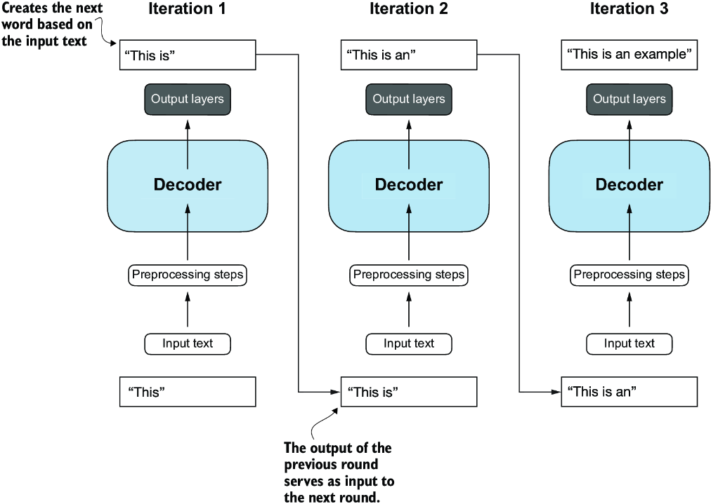

# Chapter 1. Understanding Large Language Models

## Table of Contents
- [Pretraining and Fine-tuning](#pretraining-and-fine-tuning)
- [Transformer Architecture](#transformer-architecture)
- [GPT Architecture](#gpt-architecture)
- [Three Stages of LLM Development](#three-stages-of-llm-development)
- [Key Takeaways](#key-takeaways)
- [📖 Original Excerpt](#-original-excerpt)

---

A Large Language Model (LLM) is a **neural network designed to understand and generate human-like text**.  
Its key feature is learning from massive amounts of text data to understand context and generate new text accordingly.

---

## Pretraining and Fine-tuning

The first step is **pretraining**.  
In this stage, the model is trained to predict the next word given large amounts of unlabeled *raw text*.  
- *Raw text* = plain text without labels  
- Result = **pretrained LLM** or **foundation model**

The next step is **fine-tuning**, where the pretrained model is adapted to specific tasks using labeled datasets.  

### Two common fine-tuning methods
- **Instruction fine-tuning**: trained on instruction–response pairs (e.g., request: translate → response: correct translation).  
- **Classification fine-tuning**: trained on text–label pairs (e.g., emails → “spam” or “not spam”).  

---

## Transformer Architecture

Modern LLMs are based on the **Transformer architecture** (Vaswani et al., 2017, *Attention Is All You Need*).  
It consists of two components:

- **Encoder**: converts input text into contextual representations (vectors).  
- **Decoder**: generates output text from these representations.  

A core mechanism is **Self-Attention**, which dynamically weighs the importance of words relative to each other.  
This allows the model to capture **long-range dependencies** and **contextual relationships**.  

---

## GPT Architecture

GPT uses **only the Decoder** part of the Transformer.  
It generates text **left-to-right, one word at a time**, making it well-suited for text generation and next-word prediction.  

---

## Three Stages of LLM Development

Developing and applying an LLM can be summarized in three stages:

1. **Implement architecture & prepare data**  
   - Define the Transformer-based LLM  
   - Preprocess training data  
2. **Pretraining**  
   - Train on massive text data to learn general language patterns  
   - Result: Foundation model  
3. **Fine-tuning**  
   - Adapt to specific tasks  
   - Examples: assistant-style LLM, text classifier, etc.  

---

## Key Takeaways

- **Pretraining** = learning general language patterns  
- **Fine-tuning** = adapting to specific tasks  
- **Transformer** = Encoder + Decoder with Self-Attention  
- **GPT** = Decoder-only, specialized for text generation  
- **LLM pipeline** = Architecture → Pretraining → Fine-tuning  

---

## 📖 Original Excerpt

Original Text

An LLM is a neural network designed to understand, generate, and respond to human-like text. 

The first step in creating an LLM is to train it on a large corpus of text data, sometimes referred to as raw text. Here, *"raw"* refers to the fact that this data is just regular text without any labeling information.

This first training stage of an LLM is also known as **pretraining**, creating an initial pretrained LLM, often called a *base* or *foundation model*. 

After obtaining a pretrained LLM by training on large text datasets, where the LLM is trained to predict the next word in the text, we can further train the LLM on labeled data, also known as **fine-tuning**.

The two most popular categories of fine-tuning LLMs are **instruction fine-tuning** and **classification fine-tuning**. In instruction fine-tuning, the labeled dataset consists of instruction and answer pairs, such as a query to translate a text accompanied by the correctly translated text. In classification fine-tuning, the labeled dataset consists of texts and associated class labels—for example, emails associated with “spam” and “not spam” labels.

Most modern LLMs rely on the transformer architecture, which is a deep neural network architecture introduced in the 2017 paper “Attention Is All You Need” (https://arxiv.org/abs/1706.03762).

The transformer architecture consists of two submodules: an *encoder* and a *decoder*. The encoder module processes the input text and encodes it into a series of numerical representations or vectors that capture the contextual information of the input. Then, the decoder module takes these encoded vectors and generates the output text. 

A key component of transformers and LLMs is the **self-attention mechanism**, which allows the model to weigh the importance of different words or tokens in a sequence relative to each other. This mechanism enables the model to capture long-range dependencies and contextual relationships within the input data, enhancing its ability to generate coherent and contextually relevant output.

The GPT architecture employs only the decoder portion of the original transformer. It is designed for unidirectional, left-to-right processing, making it well suited for text generation and next-word prediction tasks to generate text in an iterative fashion, one word at a time.

The three main stages of coding an LLM are implementing the LLM architecture and data preparation process (stage 1), pretraining an LLM to create a foundation model (stage 2), and fine-tuning the foundation model to become a personal assistant or text classifier (stage 3).

