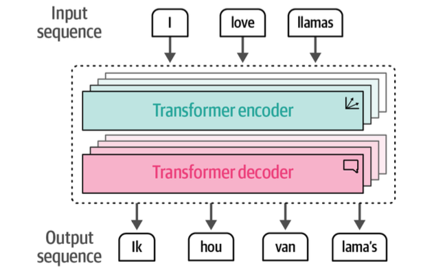
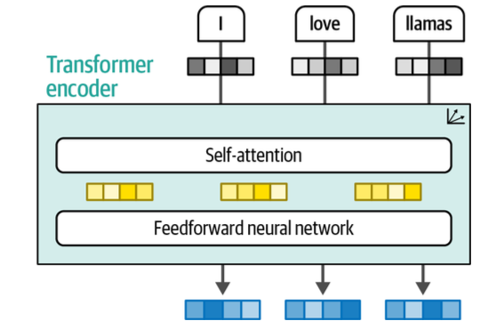
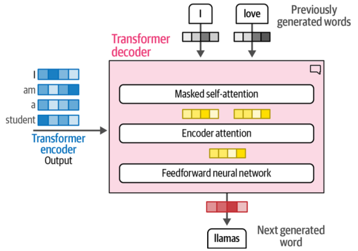
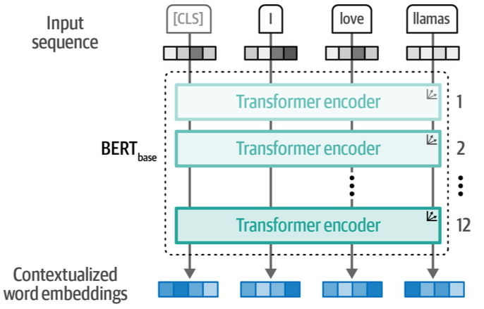
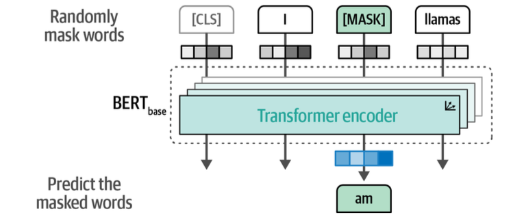

# Chapter 1. An Introduction to Large Language Models

## Table of Contents
- [Embeddings](#embeddings)
- [Transformer 구조](#transformer-구조)
- [BERT와 Encoder-only 모델](#bert와-encoder-only-모델)
- [GPT와 Decoder-only 모델](#gpt와-decoder-only-모델)
- [LLM 개발 과정](#llm-개발-과정)
- [내가 이해한 핵심](#내가-이해한-핵심)
- [📖 원문 발췌](#-원문-발췌)

---

## Embeddings


- **임베딩(embedding)** = 데이터를 벡터로 표현해 의미를 잡아내는 방식  
- 텍스트뿐만 아니라 이미지, 음성 등 다양한 입력에 대해 생성 가능  
- 임베딩은 LLM의 **표현 학습 기반**으로, 문맥적 의미를 수치화하는 핵심 도구  

---

## Transformer 구조

- Transformer = **인코더 블록 + 디코더 블록**이 층층이 쌓인 구조  


- **Encoder** = Self-Attention + Feedforward NN  
  - 입력을 문맥적 벡터 표현으로 변환  


- **Decoder** = Masked Self-Attention + Encoder Attention + Feedforward NN  
  - Masked Self-Attention: 이미 생성된 단어들(Previously generated words) 간의 문맥적 관계를 파악
  - Encoder Attention (Cross-Attention): 인코더 출력(Transformer encoder Output)과 Masked Self-Attention의 결과 간의 관계를 통해 입력 문장의 문맥을 참조
  - 이 두 가지 어텐션 메커니즘을 활용하여 다음에 올 단어(Next generated word)를 예측하고 생성

---

## BERT와 Encoder-only 모델

- **BERT** = Encoder-only 구조  


- 훈련 방법 = **Masked Language Modeling (MLM)**  
  - 입력 문장에서 일부 단어를 가려(mask) 예측하도록 학습  
  - 가려진 단어를 예측하기 위해 문장의 왼쪽과 오른쪽 문맥을 모두 참고하므로 '양방향(Bidirectional)' 문맥 이해 능력이 뛰어남


- 특징:
  - 텍스트 **표현(representation)** 학습에 최적화  
  - 주로 **Transfer Learning**에 활용 (사전학습 후 특정 태스크 파인튜닝)  
  - 생성(generation)보다는 의미 파악에 집중  

---

## GPT와 Decoder-only 모델


- **GPT** = Decoder-only 구조  
- 목적: **생성(generative tasks)**  
- 텍스트를 왼쪽에서 오른쪽으로 한 단어씩 예측하며 생성 (순방향/자기회귀, Autoregressive 방식)
- 초기 모델(GPT-1)은 BERT와 달리 **언어 생성**에 최적화됨  
- 이후 GPT-2, GPT-3, GPT-4로 확장 → 오늘날의 LLM 흐름을 주도  

---

## LLM 개발 과정


전통 ML = 특정 태스크 전용 모델 훈련 (1-step).  
LLM = **2-step 학습 과정**:

1. **Pretraining (사전학습)**  
   - 방대한 텍스트 데이터로 일반 언어 패턴 학습  
   - 결과: *Foundation Model / Base Model*  
   - 예: Llama 2는 약 2조 개의 토큰으로 학습됨  
   - 매우 비용이 크고 대규모 컴퓨팅 자원이 필요  

2. **Fine-tuning (파인튜닝)**  
   - 사전학습된 모델을 특정 태스크/행동으로 조정  
   - 예: 분류기(classifier), 지시 따르는 모델(instruction-following)  
   - Pretraining의 비용을 절약할 수 있는 실용적 접근  

→ Pretrained Model = Pretraining만 거친 모델 + Fine-tuned 모델 모두 포함  

---

## 내가 이해한 핵심

- **Embeddings** = 데이터 의미를 벡터로 표현  
- **BERT** = Encoder-only, MLM 기반 → 양방향 문맥을 통한 표현 학습 최적화
- **GPT** = Decoder-only, 자기회귀(Autoregressive) 방식 → 텍스트 생성 최적화
- **Representation vs Generative Models**
  - Representation Models (BERT류): 언어 이해, 임베딩 생성  
  - Generative Models (GPT류): 텍스트 생성  
- **LLM 학습 과정**
  - Pretraining = 언어 일반 패턴 습득  
  - Fine-tuning = 특정 태스크 최적화  

---

## 📖 원문 발췌

Embeddings are vector representations of data that attempt to capture its meaning. 

Embeddings can be created for different types of input.

The Transformer is a combination of stacked encoder and decoder blocks where the input flows through each encoder and decoder.

The encoder block in the Transformer consists of two parts, self-attention and a feedforward neural network.

The decoder has an additional attention layer that attends to the output of the encoder.

BERT(Bidirectional Encoder Representations from Transformers) is an encoder-only architecture that focuses on representing language. This means that it only uses the encoder and removes the decoder entirely.

Training these encoder stacks can be a difficult task that BERT approaches by adopting a technique called masked language modeling. This method masks a part of the input for the model to predict. This prediction task is difficult but allows BERT to create more accurate (intermediate) representations of the input.

This architecture and training procedure makes BERT and related architectures incredible at representing contextual language. BERT-like models are commonly used for transfer learning, which involves first pretraining it for language modeling and then fine-tuning it for a specific task. For instance, by training BERT on the entirety of Wikipedia, it learns to understand the semantic and contextual nature of text. Then, as shown in Figure 1-23, we can use that pretrained model to fine-tune it for a specific task, like text classification.

Throughout the book, we will refer to encoder-only models as representation models to differentiate them from decoder-only, which we refer to as generative models. Note that the main distinction does not lie between the underlying architecture and the way these models work. Representation models mainly focus on representing language, for instance, by creating embeddings, and typically do not generate text. In contrast, generative models focus primarily on generating text and typically are not trained to generate embeddings.

Similar to the encoder-only architecture of BERT, a decoder-only architecture was proposed in 2018 to target generative tasks. This architecture was called a Generative Pre-trained Transformer (GPT) for its generative capabilities (it’s now known as GPT-1 to distinguish it from later versions). It stacks decoder blocks similar to the encoder-stacked architecture of BERT.

These generative decoder-only models, especially the “larger” models, are commonly referred to as large language models (LLMs). As we will discuss later in this chapter, the term LLM is not only reserved for generative models (decoder-only) but also representation models (encoder-only).

Traditional machine learning generally involves training a model for a specific task,
like classification. We consider this to be a one-step process.

Creating LLMs, in contrast, typically consists of at least two steps:
1) Language modeling
    
    The first step, called *pretraining*, takes the majority of computation and training time. An LLM is trained on a vast corpus of internet text allowing the model to learn grammar, context, and language patterns. This broad training phase is not yet directed toward specific tasks or applications beyond predicting the next word. The resulting model is often referred to as a *foundation model* or *base model*. These models generally do not follow instructions.

2) Fine-tuning

    The second step, *fine-tuning* or sometimes *post-training*, involves using the previously trained model and further training it on a narrower task. This allows the LLM to adapt to specific tasks or to exhibit desired behavior. For example, we could fine-tune a base model to perform well on a classification task or to follow instructions. It saves massive amounts of resources because the pretraining phase is quite costly and generally requires data and computing resources that are out of the reach of most people and organizations. For instance, Llama 2 has been trained on a dataset containing 2 trillion tokens. Imagine the compute necessary to create that model!
    
Any model that goes through the first step, *pretraining*, we consider a *pretrained model*, which also includes fine-tuned models.

```python
from transformers import AutoModelForCausalLM, AutoTokenizer, pipeline

model = AutoModelForCausalLM.from_pretrained(
    "microsoft/Phi-3-mini-4k-instruct",
    device_map="mps",
    torch_dtype="auto",
    trust_remote_code=True,
)
tokenizer = AutoTokenizer.from_pretrained("microsoft/Phi-3-mini-4k-instruct")


# Create a pipeline
generator = pipeline(
    "text-generation",
    model=model,
    tokenizer=tokenizer,
    return_full_text=False,
    max_new_tokens=500,
    do_sample=False
)

# The prompt (user input / query)
messages = [
    {"role": "user", "content": "Create a funny joke about chickens."}
]

# Generate output
output = generator(messages)
print(output[0]["generated_text"])
# Why did the chicken join the band? Because it had the drumsticks!
```